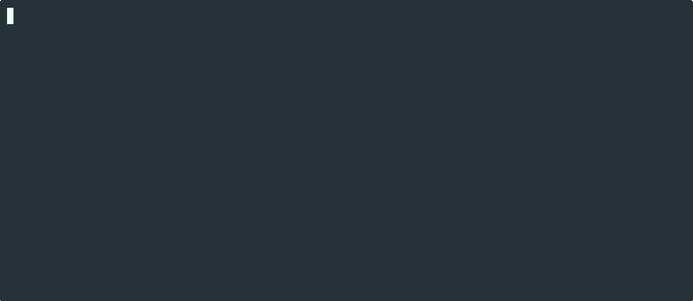

# Steko

A simple and secure steganography tool using AES, the LSB method and pseudorandom pixel order to hide payloads in
lossless image formats.

## ✨ Features

- **Mandatory Encryption** - Your secrets are not only hidden, they are encrypted.
- **Stored in Scrambled Order** - Makes detection even harder, and brute force virtually impossible.
- **Customizable Bitmask** - Allows for multiple payloads, better stealth in some color contexts, and variable capacity.
- **Designed for Lossless Formats** - Images can be converted between any present or future format and still work.
- **Single Binary** - With convenient CLI usage for Linux and macOS.

## 📜 Documentation

- [**Installation**](docs/installation.md) - Instructions for downloading the binaries.
- [**CLI User Guide**](docs/cli_userguide.md) - Describes the CLI arguments and exemplifies common use-cases
- [**Algorithm Specification**](docs/algorithm.md) - Describes implementation steps.
- [**Security**](docs/security.md) - Comments on robustness.
- [**Party Tricks**](docs/party_tricks.md) - Examples of bonus niche uses.
- [**F.A.Q.**](docs/faq.md) - Frequently asked questions.

## ⚖️ License

Copyright © 2026 Dan Cîmpianu

This program is free software: you can redistribute it and/or modify
it under the terms of the GNU General Public License as published by
the Free Software Foundation, either version 3 of the License, or
(at your option) any later version.

This program is distributed in the hope that it will be useful,
but WITHOUT ANY WARRANTY; without even the implied warranty of
MERCHANTABILITY or FITNESS FOR A PARTICULAR PURPOSE.  See the
GNU General Public License for more details.

You should have received a copy of the GNU General Public License
along with this program.  If not, see <https://www.gnu.org/licenses/>.
 